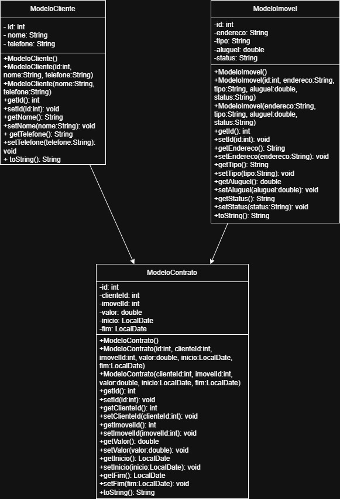
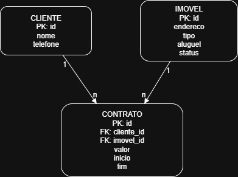

# poo_trabalho_imobiliaria

## Equipe

| Equipe   | Email             |
|----------|------------------|
| Nicole   | nicole.bineck@univille.com          |
| Luisa  | luisa.cavagnollo@univille.com         |

---

## Configurações

| Item            | Valor       |
|-----------------|------------|
| Banco de Dados  | PostgreSQL      |
| Schema          | imobiliaria |

---

## Diagrama de classe da UML

  

---

## Diagrama MER

  

---

## Instruções SQL

### Criação do schema e tabelas

```sql
-- Criação do schema
CREATE SCHEMA IF NOT EXISTS imobiliaria;
USE imobiliaria;

-- Tabela CLIENTES
CREATE TABLE clientes (
    id SERIAL PRIMARY KEY,
    nome VARCHAR(100) NOT NULL,
    telefone VARCHAR(20)
);

-- Tabela IMOVEIS
CREATE TABLE imoveis (
    id SERIAL PRIMARY KEY,
    endereco VARCHAR(150) NOT NULL,
    tipo VARCHAR(50),
    aluguel NUMERIC(10,2) NOT NULL,
    status VARCHAR(20) DEFAULT 'disponivel'
);

-- Tabela CONTRATOS
CREATE TABLE contratos (
    id SERIAL PRIMARY KEY,
    cliente_id INT NOT NULL,
    imovel_id INT NOT NULL,
    valor NUMERIC(10,2) NOT NULL,
    inicio DATE NOT NULL,
    fim DATE NOT NULL,
    FOREIGN KEY (cliente_id) REFERENCES clientes(id) ON DELETE CASCADE,
    FOREIGN KEY (imovel_id) REFERENCES imoveis(id) ON DELETE CASCADE
);

```
---

## Instruções SQL

### Criação do schema e tabelas

```sql

-- Inserindo clientes
INSERT INTO clientes (nome, telefone) VALUES
('Ana Souza', '11999990001'),
('Bruno Lima', '11999990002'),
('Carla Mendes', '11999990003');

-- Inserindo imóveis
INSERT INTO imoveis (endereco, tipo, aluguel, status) VALUES
('Rua das Flores, 123', 'Apartamento', 1500.00, 'disponivel'),
('Av. Brasil, 456', 'Casa', 2500.00, 'disponivel'),
('Rua Central, 789', 'Apartamento', 1800.00, 'disponivel');

-- Inserindo contratos
-- Supondo que os IDs dos clientes e imóveis começam em 1
INSERT INTO contratos (clienteid, imovelid, valor, inicio, fim) VALUES
(1, 1, 1500.00, '2025-08-01', '2026-07-31'),
(2, 2, 2500.00, '2025-08-15', '2026-08-14'),
(3, 3, 1800.00, '2025-09-01', '2026-08-31');

```
